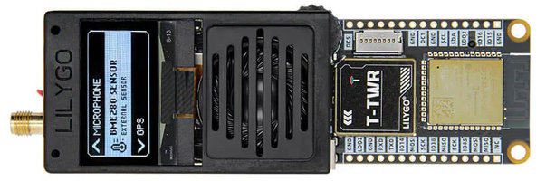
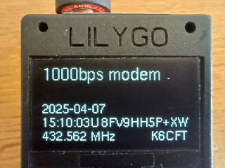

# T-TWR 2.1 Modem (up to 1000bps)

The [Lilygo T-TWR device (revision
2.1)](https://github.com/Xinyuan-LilyGO/T-TWR) is a programmable
walkie talkie for the UHF band (400-480MHz, 70cm). This frequency range
includes the license-free PMR bands in Europe as well as the IARU-R1
70cm radio amateur band. Note that the device can only be operated by
radio amateurs due to the device characteristics (detachable antenna,
2W RF power).

The C code in this repo implements a FSK software modem for the T-TWR
for up to 1000 bits-per-second data rate (4-FSK/500 Baud or 2-FSK/600
Baud). Thanks to the use of LDPC forward error correction and CRCs,
error-free transmission can easily be demonstrated for distances
beyond one mile, out-of-the box.

Enjoy! 73, HB9HUH/K6CFT

## Implemented Features

- demonstrates phase-continuous 4-FSK and 2-FSK modulation
- uses the ESP32-S3 Sigma-Delta modulation for generating the FSK audio signal
- uses the ESP32-S3 hardware-based ADC sampling at 6400 Hz
- shows the use of the Fast Hartley Transform for analyzing the received audio
- demonstrates the synthesis of a symbol-level synchronization clock signal, using FHT data
- demonstrates a real-time waterfall display on the serial line using ASCII ART
- supports variable-length data packets up to 128 bytes
- offers configurable Low Density Parity Check (LDPC) forward error correction (256, 512 or 1024 parity bits), resulting in code rates of 4/5, 2/3 or 1/2
- LDPC decoding is executed on the ESP32
- uses the CCSDS (Council of the Consultative Committee for Space Data Systems) randomizer/scrambler from 2023
- uses the 64-bit CCSDS CSMs (Codeblock Sync Marker) for framing
- uses a 12-bit CRC checksum for aditional protection
- implements a simple echo-request service for testing connectivity in the field: messages include GPS timestamp and location, if available
- a log of sent and received messages is persisted in flash (on-device flash file system)
- a command line interface (serial line) permits to inspect the log and display debugging information

## Desirable Features

Future extensions may include

- BLE interface for sending and receiving packets

---
